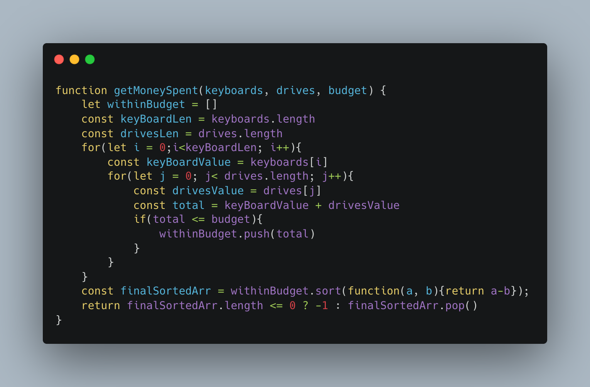
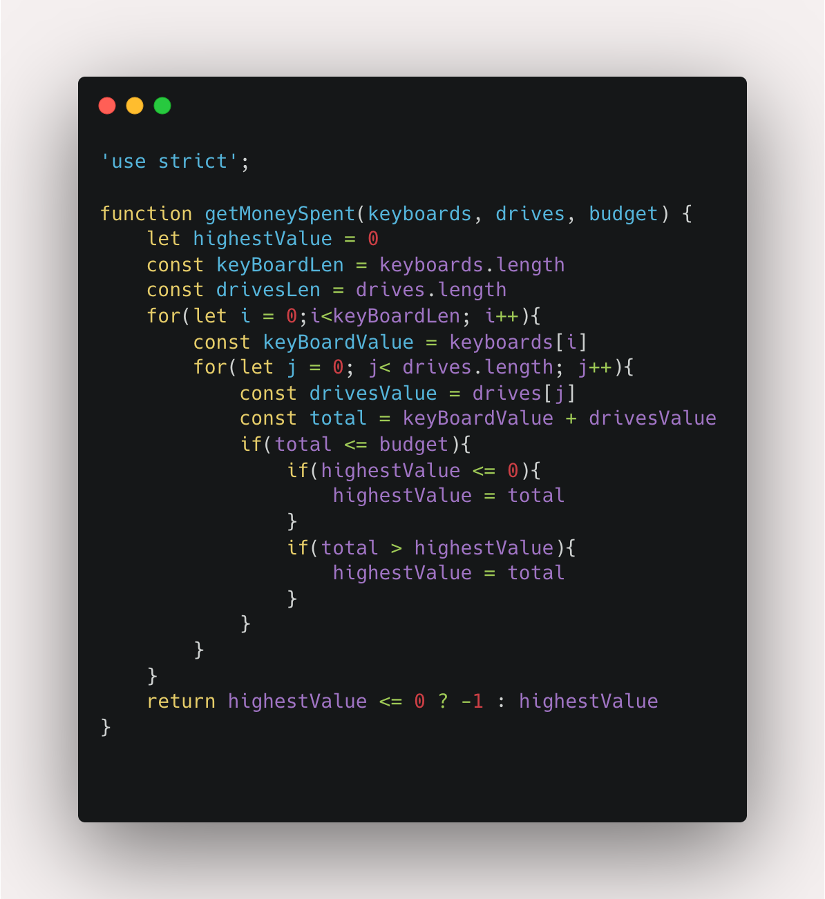

## Electronics Shop

Line 1 - budget, length of keyboard, length of drives 
Line 2 - keyboard cost array 
Line 3 - Drives cost array

Find the biggest combination a person can buy with the given budget(budget should not exceed)__
Sample Input__
10 2 3 
3 1 
5 2 8

expected Output 9
 
 
Sample Input__
5 1 1 
4 
5
 
expected Output -1
 

Explanation: 
There is no way to buy one keyboard and one USB drive because , so return .

# Code
## Solution One

## Solution Two
